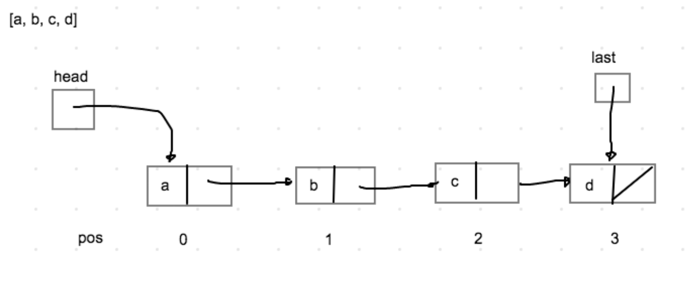
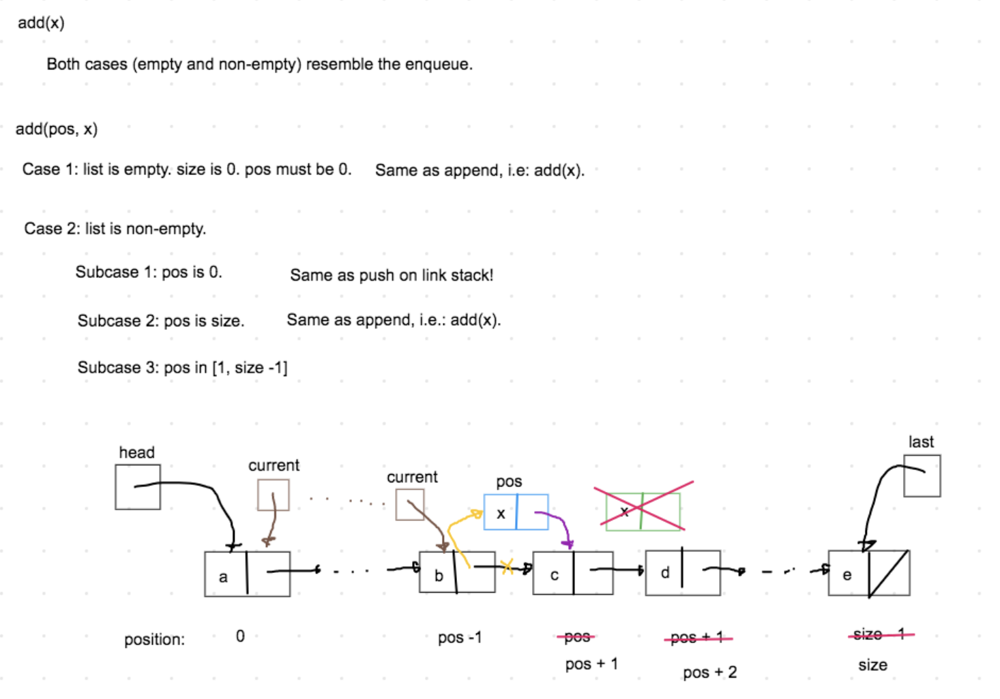
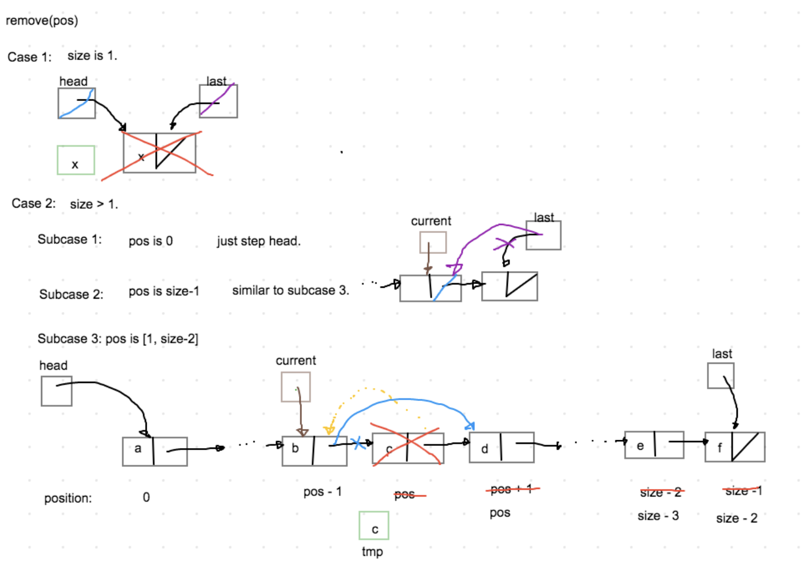

# Exercise 8.3 - 🔗 Linked List

## 🎯 Objectives

- **Implement** a linked list data structure in Java.

## 🔨 Setup

1. Clone the repo (or download the zip) for this exercise, which you can find [here](https://github.com/JAC-CS-Programming-4-W23/E8.3-Linked-List).
2. Start IntelliJ, go to `File -> Open...`, and select the cloned/downloaded folder.
3. If at the top it says "Project JDK is not defined", click "Setup JDK" on the top right, and select the JDK version you have installed on your machine.

   

4. To get the unit tests to work, open `TestLinkedList.java` and add JUnit to the classpath:

   

   - Just click "OK" on the resulting dialogue window and all the test-related red squigglies should disappear.

## 🔍 Context

So far in this course, we've used arrays as the base of our data structures. It's easy, then, to associate arrays as the defacto way to implement any data structure. However, this is not always the case. We can start thinking about data structures in terms of _references_ instead of contiguous blocks of memory. A **linked list** is a data structure where each of its elements contain a reference to the next element in the "chain".



Not an array in site! This is not to say that arrays are bad, it's simply another way to think of data structures.

The first think you'll see when you open `LinkedList.java` is this private inner class:

```java
private static class Link<T> {
    T element;
    Link<T> next;

    public Link() {}

    public Link(T element) {
        this.element = element;
    }
}
```

Our list will be comprised of these `Link` objects, where each `Link` has a `next` which refers to another `Link`.

## 🚦 Let's Go

Inside of the `LinkedList` class, implement the `List` interface which in turn should implement the `Traversable` interface. Pass the unit tests in `TestLinkedList`.

### `add(x)` and `add(position, x)`



### `remove(position)`



### `move()`

Use a private "helper" method to simplify our implementation. The method `move()` will position the current at the add/remove location:

```java
// Retreive the link that is steps spaces from the head.
private Link<T> move(int steps) {
    Link<T> current = head;

    for(int i = 0; i < steps; i++) {
        current = current.next; // Step
    }

    return current;
}
```

### `get()` and `set()`

These operations should be simple to implement now with the `move()` function.

## 🔬 Observations

- What do you think the performance differences might be with using a linked list instead of an array list?
- When do you think it could be advantageous to use one over the other?

---


